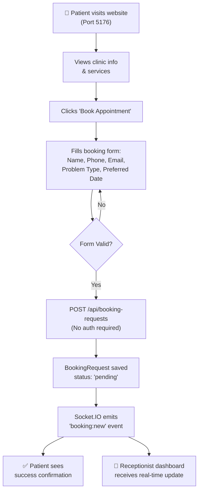
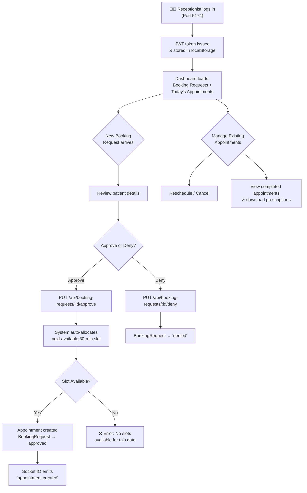
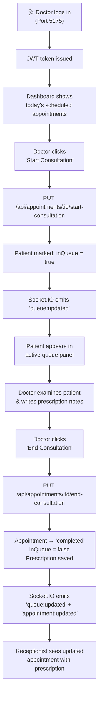
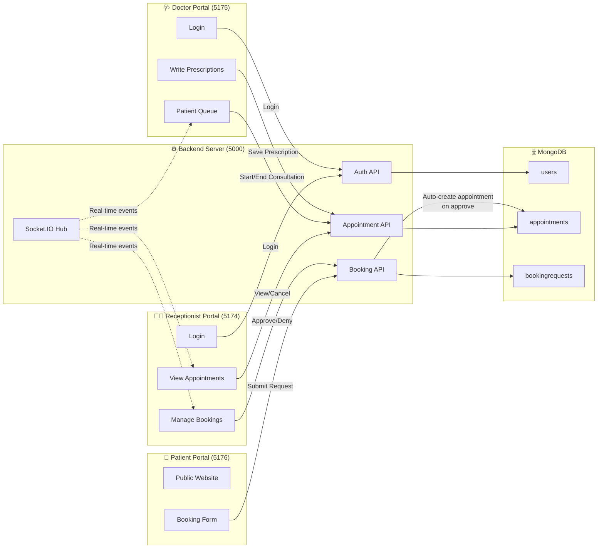

# 🏥 ClinicOS — Smart Clinic Management System

> A full-stack, real-time clinic management web application that automates appointment booking, patient queuing, prescription management, and role-based workflows for **Patients**, **Receptionists**, and **Doctors**.

---

## 📋 Table of Contents

- [Project Description](#-project-description)
- [Key Features](#-key-features)
- [Tech Stack](#-tech-stack)
- [Architecture Overview](#-architecture-overview)
- [Application Flow Diagrams](#-application-flow-diagrams)
- [Prerequisites](#-prerequisites)
- [Setup Instructions](#-setup-instructions)
- [Default Credentials](#-default-credentials)
- [API Endpoints](#-api-endpoints)
- [Project Structure](#-project-structure)

---

## 📖 Project Description

**ClinicOS** is an all-in-one operating system for a doctor's clinic. It replaces manual scheduling, paper-based prescriptions, and phone-call bookings with a streamlined, browser-based platform. The system serves three distinct user roles — each with a dedicated portal running on its own port:

| Role | Portal | Description |
|---|---|---|
| **Patient** | Public website | Browse clinic info, submit booking requests online |
| **Receptionist** | Authenticated dashboard | Approve/deny booking requests, manage appointments, view prescriptions |
| **Doctor** | Authenticated dashboard | View today's schedule, manage patient queue, write prescriptions |

Real-time communication is powered by **Socket.IO**, meaning all dashboards instantly reflect changes — when a patient submits a booking, the receptionist sees it immediately; when a doctor completes a consultation, the receptionist's view updates automatically.

---

## ✨ Key Features

- **Online Booking Requests** — Patients submit requests via a public form (no login required)
- **Smart Time-Slot Allocation** — When a receptionist approves a request, the system auto-assigns the next available 30-minute slot (clinic hours: 09:00–17:00)
- **Double-Booking Prevention** — Unique index on `(date, timeSlot, status)` ensures no scheduling conflicts
- **Real-Time Updates** — Socket.IO pushes live events across all connected portals
- **Patient Queue System** — Doctor starts/ends consultations, moving patients through an in-app queue
- **Prescription Notes** — Doctor writes prescriptions during consultation; saved and viewable by receptionist
- **JWT Authentication** — Secure login with role-based access control (receptionist or doctor)
- **Appointment Lifecycle** — Full CRUD: create, reschedule, cancel, and complete appointments

---

## 🛠 Tech Stack

| Layer | Technology |
|---|---|
| **Frontend** | React 19, Vite 8, TailwindCSS 4, Axios, React Router v7, React Hook Form |
| **Backend** | Node.js, Express 5, Mongoose (MongoDB ODM), Socket.IO |
| **Database** | MongoDB |
| **Auth** | JWT (jsonwebtoken), bcryptjs |
| **Validation** | express-validator |
| **Real-Time** | Socket.IO (server + client) |

---

## 🏗 Architecture Overview

```
┌─────────────────────────────────────────────────────────────────────┐
│                         CLIENT (React + Vite)                       │
│                                                                     │
│  ┌──────────────┐  ┌──────────────────┐  ┌───────────────────────┐  │
│  │  Patient App  │  │ Receptionist App │  │     Doctor App        │  │
│  │  Port: 5176   │  │   Port: 5174     │  │    Port: 5175         │  │
│  │  (Public)     │  │  (Auth Required) │  │   (Auth Required)     │  │
│  └──────┬───────┘  └────────┬─────────┘  └───────────┬───────────┘  │
│         │                   │                        │              │
└─────────┼───────────────────┼────────────────────────┼──────────────┘
          │  HTTP + WebSocket │                        │
          ▼                   ▼                        ▼
┌─────────────────────────────────────────────────────────────────────┐
│                    SERVER (Express + Socket.IO)                      │
│                         Port: 5000                                  │
│                                                                     │
│  ┌─────────────┐  ┌──────────────────┐  ┌───────────────────────┐   │
│  │ Auth Routes  │  │ Appointment      │  │ Booking Request       │   │
│  │  /api/auth   │  │ Routes           │  │ Routes                │   │
│  │              │  │ /api/appointments│  │ /api/booking-requests  │  │
│  └─────────────┘  └──────────────────┘  └───────────────────────┘   │
│                                                                     │
│  ┌─────────────────────────────────────────────────────────────┐    │
│  │              Middleware: JWT Authentication                   │    │
│  └─────────────────────────────────────────────────────────────┘    │
└────────────────────────────────┬────────────────────────────────────┘
                                 │
                                 ▼
                    ┌────────────────────────┐
                    │     MongoDB Database   │
                    │   Database: "clinic"   │
                    │                        │
                    │  Collections:          │
                    │  • users               │
                    │  • appointments         │
                    │  • bookingrequests      │
                    └────────────────────────┘
```

---

## 📊 Application Flow Diagrams

### 1. Patient Booking Flow



### 2. Receptionist Workflow



### 3. Doctor Consultation Flow



### 4. Complete System Interaction



---

## ✅ Prerequisites

Before setting up the project, ensure you have the following installed:

| Dependency | Version | Check Command |
|---|---|---|
| **Node.js** | v18 or higher | `node -v` |
| **npm** | v9 or higher | `npm -v` |
| **MongoDB** | v6 or higher | `mongod --version` |
| **Git** | Any recent version | `git --version` |

> **Note:** MongoDB must be running locally on the default port `27017`. You can start it with:
> ```bash
> sudo systemctl start mongod     # Linux (systemd)
> brew services start mongodb-community  # macOS (Homebrew)
> ```

---

## 🚀 Setup Instructions

### Step 1: Clone the Repository

```bash
git clone <repository-url>
cd hacketon
```

### Step 2: Set Up the Backend Server

```bash
# Navigate to the server directory
cd server

# Install dependencies
npm install

# Create the environment file (already included, but verify)
# .env should contain:
#   PORT=5000
#   MONGO_URI=mongodb://127.0.0.1:27017/clinic
#   JWT_SECRET=supersecret123

# Seed the database with default user accounts
node seed.js

# Start the server
npm start
```

> The server will start on **http://localhost:5000**

### Step 3: Set Up the Frontend Client

Open a **new terminal** window:

```bash
# Navigate to the client directory
cd client

# Install dependencies
npm install

# Create the environment file (already included, but verify)
# .env should contain:
#   VITE_API_URL=http://localhost:5000/api
```

### Step 4: Launch the Portals

You need to run **three separate Vite dev servers** — one for each user role. Open three terminal windows/tabs:

**Terminal 1 — Receptionist Portal:**
```bash
cd client
npm run dev:receptionist
# → Runs on http://localhost:5174
```

**Terminal 2 — Doctor Portal:**
```bash
cd client
npm run dev:doctor
# → Runs on http://localhost:5175
```

**Terminal 3 — Patient Portal:**
```bash
cd client
npm run dev:patient
# → Runs on http://localhost:5176
```

### Step 5: Access the Application

| Portal | URL | Auth Required? |
|---|---|---|
| **Patient Website** | [http://localhost:5176](http://localhost:5176) | ❌ No |
| **Receptionist Dashboard** | [http://localhost:5174](http://localhost:5174) | ✅ Yes |
| **Doctor Dashboard** | [http://localhost:5175](http://localhost:5175) | ✅ Yes |

---

## 🔑 Default Credentials

Created by `seed.js` — use these to log in:

| Role | Username | Password |
|---|---|---|
| **Receptionist** | `receptionist` | `passwordqwerty` |
| **Doctor** | `doctor` | `passwordqwerty` |

> ⚠️ **For production use**, change the `JWT_SECRET` in `server/.env` and update the default passwords.

---

## 📡 API Endpoints

### Authentication (`/api/auth`)

| Method | Endpoint | Auth | Description |
|---|---|---|---|
| `POST` | `/api/auth/register` | ❌ | Register a new user (receptionist/doctor) |
| `POST` | `/api/auth/login` | ❌ | Login and receive JWT token |
| `GET` | `/api/auth/me` | ✅ | Get current logged-in user info |

### Appointments (`/api/appointments`)

| Method | Endpoint | Auth | Description |
|---|---|---|---|
| `GET` | `/api/appointments?date=YYYY-MM-DD` | ✅ | List appointments (optionally filter by date) |
| `POST` | `/api/appointments` | ✅ | Book a new appointment |
| `PUT` | `/api/appointments/:id` | ✅ | Update/reschedule an appointment |
| `DELETE` | `/api/appointments/:id` | ✅ | Cancel an appointment (soft delete) |
| `PUT` | `/api/appointments/:id/start-consultation` | ✅ | Add patient to queue |
| `PUT` | `/api/appointments/:id/end-consultation` | ✅ | Complete consultation & save prescription |

### Booking Requests (`/api/booking-requests`)

| Method | Endpoint | Auth | Description |
|---|---|---|---|
| `POST` | `/api/booking-requests` | ❌ | Patient submits a booking request |
| `GET` | `/api/booking-requests?status=pending` | ✅ | List booking requests |
| `PUT` | `/api/booking-requests/:id/approve` | ✅ | Approve & auto-create appointment |
| `PUT` | `/api/booking-requests/:id/deny` | ✅ | Deny a booking request |
| `GET` | `/api/booking-requests/next-slot/:date` | ✅ | Preview next available time slot |

---

## 📁 Project Structure

```
hacketon/
├── client/                          # Frontend (React + Vite)
│   ├── .env                         # Client environment variables
│   ├── package.json                 # Client dependencies & scripts
│   ├── index.html                   # Main SPA entry (admin)
│   ├── patient.html                 # Patient portal entry
│   ├── doctor.html                  # Doctor portal entry
│   ├── receptionist.html            # Receptionist portal entry
│   ├── vite.config.js               # Default Vite config
│   ├── vite.patient.config.js       # Patient portal config (port 5176)
│   ├── vite.doctor.config.js        # Doctor portal config (port 5175)
│   ├── vite.receptionist.config.js  # Receptionist portal config (port 5174)
│   └── src/
│       ├── main.jsx                 # Default app entry point
│       ├── patient-main.jsx         # Patient app entry point
│       ├── doctor-main.jsx          # Doctor app entry point
│       ├── receptionist-main.jsx    # Receptionist app entry point
│       ├── context/
│       │   └── AuthContext.jsx      # JWT auth context provider
│       ├── components/
│       │   └── BookingForm.jsx      # Reusable booking form component
│       └── pages/
│           ├── Login.jsx            # Login page (doctor/receptionist)
│           ├── PatientWebsite.jsx   # Public patient-facing landing page
│           ├── PatientBookingForm.jsx  # Patient booking form page
│           ├── ReceptionistDashboard.jsx  # Receptionist management dashboard
│           └── DoctorDashboard.jsx  # Doctor consultation dashboard
│
└── server/                          # Backend (Express + MongoDB)
    ├── .env                         # Server environment variables
    ├── package.json                 # Server dependencies
    ├── server.js                    # Main server entry point
    ├── seed.js                      # Database seeder script
    ├── middleware/
    │   └── auth.js                  # JWT authentication middleware
    ├── models/
    │   ├── User.js                  # User model (username, password, role)
    │   ├── Appointment.js           # Appointment model (patient, date, slot, Rx)
    │   └── BookingRequest.js        # Booking request model (patient details)
    └── routes/
        ├── auth.js                  # Register, login, get-me routes
        ├── appointments.js          # CRUD + consultation routes
        └── bookingRequests.js       # Submit, approve, deny routes
```

---

## 🔌 Socket.IO Events

| Event | Emitted When | Consumed By |
|---|---|---|
| `booking:new` | Patient submits a booking request | Receptionist |
| `booking:approved` | Receptionist approves a booking | All dashboards |
| `booking:denied` | Receptionist denies a booking | All dashboards |
| `appointment:created` | New appointment is created | All dashboards |
| `appointment:updated` | Appointment is modified | All dashboards |
| `appointment:cancelled` | Appointment is cancelled | All dashboards |
| `queue:updated` | Patient enters/leaves queue | Doctor, Receptionist |
